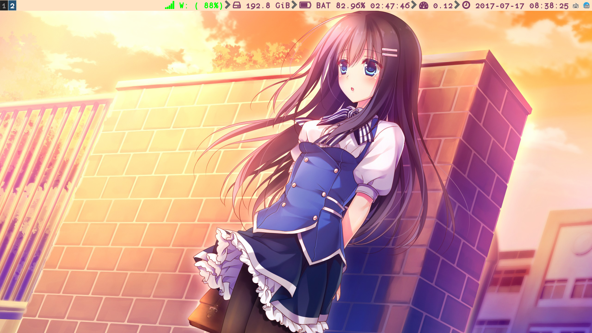

This is my configuration for i3 wm.

1. Backup configuration in `~/.config/i3` and `~/.config/i3status`.

``` shell
cd ~/.config
mv i3 i3_backup
mv i3status i3status_backup
```

2. Clone this repository to `~/.config/i3`.

``` shell
git clone git@github.com:liuxueyang/i3-config.git ~/.config/i3
cd ~/.config
ln -s i3/i3status i3status
```

3. Type `$mod + Shift + r` to reload i3 configuration.

----

Screenshot


